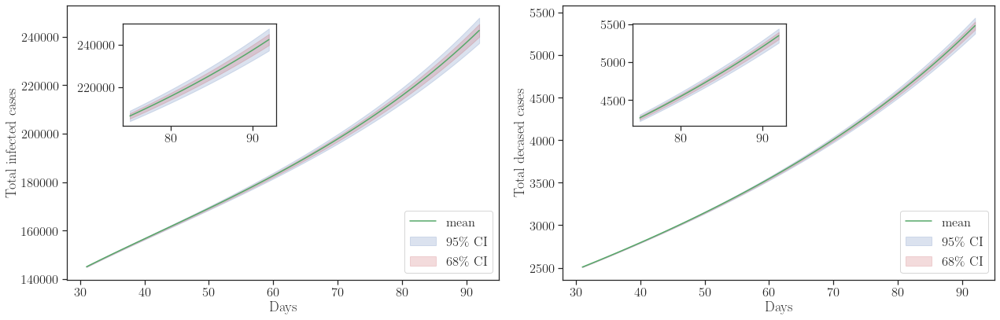
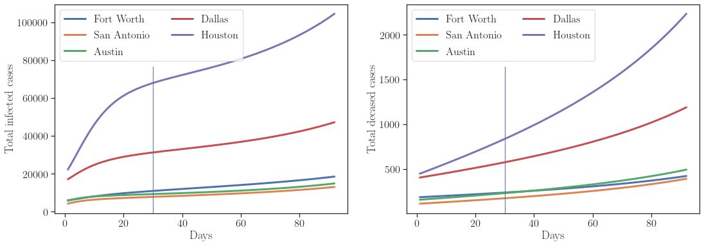
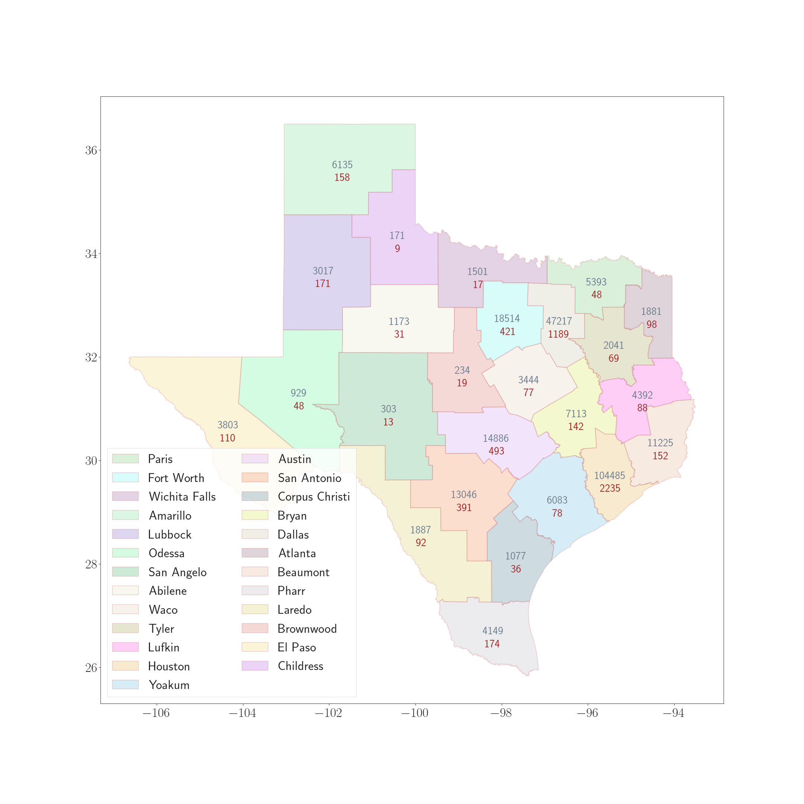

+++
# Project title.
title = "COVID-19 modeling and Bayesian based model calibration"

# Date this page was created.
date = 2020-08-02T00:00:00

# Project summary to display on homepage.
summary = "Study and apply different models of epidemic spread to COVID-19, and perform model calibration and selection using Bayesian based methods"

# Tags: can be used for filtering projects.
# Example: `tags = ["machine-learning", "deep-learning"]`
tags = ["COVID-19", "computational", "Bayesian", "model inference"]

# Optional external URL for project (replaces project detail page).
external_link = ""

# Slides (optional).
#   Associate this project with Markdown slides.
#   Simply enter your slide deck's filename without extension.
#   E.g. `slides = "example-slides"` references 
#   `content/slides/example-slides.md`.
#   Otherwise, set `slides = ""`.
#slides = "example-slides"

# Links (optional).
url_pdf = "https://prashjha.github.io/publication/jha-2020-seird/Jha-2020-seird.pdf"
url_slides = ""
url_video = ""
url_code = "https://github.com/prashjha/BayesForSEIRD"

# Featured image
# To use, add an image named `featured.jpg/png` to your project's folder. 
[image]
  # Caption (optional)
  caption = "Prediction of COVID-19 cases in districts of Texas state"
  
  # Focal point (optional)
  # Options: Smart, Center, TopLeft, Top, TopRight, Left, Right, BottomLeft, Bottom, BottomRight
  focal_point = "Smart"
+++

## Introduction

We model the spread of COVID-19 infection in Texas using PDE based SEIRD model. The model describes spatially changing susceptible, exposed, infectious, recovered, and a deceased fraction of the population. The model is discretized using finite element approximation and an implicit Euler scheme. At each time step, we perform fixed-point iteration to solve the coupled equations; see paper for more details. The solver is implemented using [FEniCS](https://fenicsproject.org/).

To infer for the model parameters and to check the validity of the model, we employ the Bayesian inference in OPAL (Occam Plausibility Algorithm), see [Oden et al. 2017](https://onlinelibrary.wiley.com/doi/abs/10.1002/9781119176817.ecm2101) and [Oden 2018](https://doi.org/10.1017/S096249291800003X). The model parameters are inferred using the total number of infected and deceased cases in Texas. The results show that the model is invalid for predicting the infected patients and is *Not Invalid* to predict the deceased cases.

For Bayesian inference, [hIPPYlib](https://hippylib.github.io/) library is used. The preconditioned Crank-Nicolson (pCN) algorithm in hIPPYlib is utilized for generating posterior samples. 

- See our paper on COVID-19 modeling and model inference appeared in **Computational Mechanics** journal: [paper link](https://doi.org/10.1007/s00466-020-01889-z) and [pdf link](https://prashjha.github.io/publication/jha-2020-seird/Jha-2020-seird.pdf)

- Codes are publicly available in [GitHub](https://github.com/prashjha/BayesForSEIRD)

- This work is in collaboration with Lianghao Cao and Dr. J. Tinsley Oden at the University of Texas at Austin

## Results

### Validation results
The model was found to be invalid for predicting the total infected cases; however, it is found to be adequate for the prediction of the total deceased cases. 

### Prediction results

- By September 1, 2020, we predict to see about **7003** fatalities and **301658** infected cases. Uncertainties, in terms of the standard deviation of the QoI distribution, in deceased and infected cases are about **102** and **5786**. 

> These calculations are based on the COVID-19 data up to June 30, 2020. It is now clear that the model has underestimated the deceased cases even though it was valid. This motivates us to look further into the model. It is also possible that the upward trend of deceased cases was not strong in the data. 

- Prediction results for total infected and deceased cases in Texas starting from 1 July till 1 September 2020

- Projection of cases in the top five districts. The prediction period is July 1, 2020 – September 1, 2020

- Projection of total cases in 25 districts on August 15 (left) and September 1 (right). Red corresponds to the deceased cases, and grey corresponds to the infected cases

August 15, 2020  |  September 1, 2020
:-------------------------:|:-------------------------:
   |  

